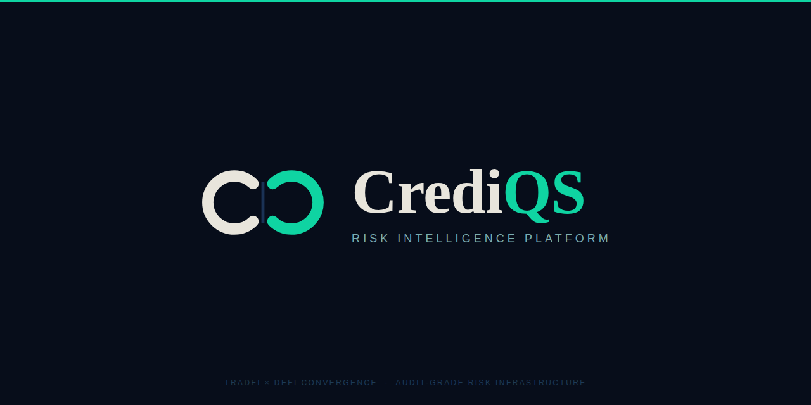

<div align="center">



# crediqs

**Institutional credit risk infrastructure · Open source · Production ready**

[](https://github.com/crediqs/pyccr)
[](https://github.com/crediqs/pycredit)
[](https://github.com/crediqs/pychain)
[](https://github.com/crediqs/crediqs-core)
[](https://github.com/crediqs)
[](LICENSE)
[](https://crediqs-api-demo.up.railway.app/docs)
[](https://discord.gg/crediqs)

</div>

---

crediqs is an open-source credit risk platform covering counterparty credit risk (SA-CCR, xVA, exposure simulation), IFRS 9 expected credit loss, on-chain DeFi risk, and real-world asset (RWA) risk. Every model is calibrated to academic research and regulatory standards, fully documented in the [crediqs-catalogue](https://github.com/crediqs/crediqs-catalogue), and available via a public REST API.

Built for banks, asset managers, fintechs, algo traders, and quant researchers who need production-grade credit risk infrastructure without building it from scratch.

> 🚀 **crediqs-platform v0.1** is now in development — a Railway-inspired canvas UI for visual risk pipeline configuration. See [Platform](#platform) below.

🚀 [Libraries](#libraries) | ⚡ [Quick Start](#quick-start) | 🖥 [Platform](#platform) | 🔌 [Integrations](#integrations) | 📋 [API](#rest-api) | 📄 [Citation](#citation)

---

## Platform overview

```
crediqs organisation
│
│  ── Libraries (pip install) ──────────────────────────────────────────────
├── pyccr              Counterparty credit risk · SA-CCR · xVA · SIMM · IRB
├── pycredit           IFRS 9 ECL · PD curves · Scorecards · Macro overlay
├── pychain            DeFi · stablecoin · RWA · smart contract · governance · carbon
├── crediqs-core       Unified rating · transition matrix · ensemble
│
│  ── Infrastructure ───────────────────────────────────────────────────────
├── crediqs-api        REST API — all libraries via HTTP
├── crediqs-catalogue  Model documentation · 73 parameters · regulatory citations
│
│  ── Platform ─────────────────────────────────────────────────────────────
├── crediqs-platform   Canvas UI · YAML spec · CLI · data adapters · LEAN integration
└── crediqs-site       Company website · crediqs.ai
```


> **Architecture:** Libraries are independent (`pip install pyccr`). crediqs-platform imports them as dependencies and adds orchestration, UI, adapters, and integrations. crediqs-api exposes everything via HTTP.

---

## Libraries

### [pyccr](https://github.com/crediqs/pyccr) — Counterparty Credit Risk
`v0.8.0 · 487 tests · Apache 2.0`

Full CCR stack from exposure simulation to regulatory capital.

```python
from pyccr import CVA, SACalculator, SIMMCalculator

# CVA — Pykhtin & Zhu (2007)
cva = CVA(pd_curve=curve, notional=10_000_000, maturity=5.0).compute()
print(f"CVA: {cva.cva:,.0f}  ({cva.cva_bps:.1f} bps)")

# SA-CCR — Basel III CRR3 Art. 274-280
ead = SACalculator(netting_set).compute()
print(f"EAD: {ead.ead_total:,.0f}")

# Exposure simulation — HW1F + GBM, 10K paths
from pyccr import ExposureEngine
engine = ExposureEngine(netting_set, model="hw1f+gbm", paths=10_000)
profile = engine.simulate()
print(f"EEPE: {profile.eepe:,.0f}  PFE95: {profile.pfe_95:,.0f}")
```

| Module | Description | Standard |
|---|---|---|
| HullWhite1F + GBM | Interest rate and FX simulation | — |
| EPE / PFE / EEPE | Exposure profile computation | BCBS d279 |
| CVA · DVA · FVA · MVA · KVA | Full xVA suite | IFRS 13 |
| SA-CCR | Standardised EAD (all 5 asset classes) | Basel III CRR3 Art. 274-280 |
| SIMM v2.6 | Initial margin (IR + FX delta) | ISDA |
| IRB · CEM | Internal ratings-based · legacy CEM | Basel II/III |

---

### [pycredit](https://github.com/crediqs/pycredit) — IFRS 9 ECL
`v0.3.0 · 185 tests · Apache 2.0`

Expected credit loss models for retail, corporate, and institutional lending.

```python
from pycredit import compute_ecl, StageClassifier, MacroOverlay

# Three-stage ECL — IFRS 9 §5.5
result = compute_ecl(ead=500_000, maturity=3.0, pd_1y=0.02, lgd=0.45, stage=1)
print(f"ECL: {result.ecl:,.0f}  ({result.ecl_rate:.3%})")

# SICR — significant increase in credit risk
stage = StageClassifier(pd_origination=0.005, pd_current=0.015).classify()
print(f"Stage: {stage}")  # Stage 2 — SICR triggered
```

| Module | Description | Standard |
|---|---|---|
| PDCurve | Flat hazard rate PD term structure | — |
| StageClassifier | SICR assessment — ratio + absolute thresholds | IFRS 9 §B5.5.9 |
| LGDModel | Constant, collateral, and stress LGD | IFRS 9 §5.5 |
| MacroOverlay | PIT adjustment via macro factor | IFRS 9 §B5.5.51 |
| WOE Scorecard | Weight-of-evidence behavioural scoring | — |
| Portfolio ECL | Batch computation with scenario weighting | IFRS 9 §B5.5.42 |

---

### [pychain](https://github.com/crediqs/pychain) — On-chain Risk
`v0.3.0 · 273 tests · Proprietary`

Credit risk models for DeFi protocols, stablecoins, tokenised assets, and carbon credits. The only open-source library covering the full PDACS (Particula Digital Asset Classification System) taxonomy.

```python
from pychain.risk.smart_contract import assess_known_protocol
from pychain.risk.governance_token import GovernanceTokenRisk
from pychain.risk.debt_token import assess_known_debt_token
from pychain.risk.carbon_token import assess_known_carbon_token

# Smart contract exploit risk — 4-factor model
sc = assess_known_protocol("aave-v3")
print(f"SC risk: {sc.risk_bps:.1f} bps  {sc.risk_label}")

# Governance token risk (RSR · HHI · SMA · timelock)
gov = GovernanceTokenRisk.for_token("aave").assess()
print(f"GOV risk: {gov.governance_risk_bps:.1f} bps  {gov.risk_label}")

# Tokenised debt (two-layer: λ_credit + λ_tokenisation)
debt = assess_known_debt_token("buidl")
print(f"BUIDL combined PD: {debt.combined_pd_1y:.4%}  {debt.rating_grade}")

# Carbon credit risk (reversal · vintage · registry · project type)
carbon = assess_known_carbon_token("bct")
print(f"BCT value retention: {carbon.effective_value_ratio:.1%}")
```

| Module | Version | Description |
|---|---|---|
| ProtocolRisk | v0.1 | DeFi liquidation bootstrap · Aave V3 · Compound V3 |
| StablecoinRisk | v0.1 | Peg stability · MiCA compliance |
| EuroStablecoinMonitor | v0.2 | MiCA Art. 43-58 · live depeg alerts |
| RWARisk | v0.2 | Tokenised RWA (BUIDL · OUSG · BENJI) |
| SmartContractRiskPremium | v0.2.1 | PDACS Method Layer · 4-factor model |
| GovernanceTokenRisk | v0.3 | RSR · HHI · SMA · timelock feedback loop |
| DebtTokenRisk | v0.3 | Two-layer credit + tokenisation model |
| CarbonTokenRisk | v0.3 | Reversal · vintage · registry · project type |

---

### [crediqs-core](https://github.com/crediqs/crediqs-core) — Unified Rating
`v0.2.0 · 186 tests · Proprietary`

The unification layer. A single `CreditRating` object from any data source — CDS spread, DeFi liquidation, scorecard, or RWA — with a migration-based PD term structure that captures the credit cliff effect.

```python
from crediqs_core import CreditRating, TransitionMatrix

# Unified rating from any source
rating = CreditRating.from_cds(cds_curve, entity="DEUTSCHE_BANK")
print(f"Grade: {rating.rating_grade}  Score: {rating.rating_score:.1f}")

# Migration-based PD — captures credit cliff (BBB 5Y PD = 2.63% vs 1.45% flat)
tm    = TransitionMatrix.sp_ttc()
curve = tm.pd_curve("BBB")
print(f"BBB 1Y: {curve.pd_1y:.3%}  5Y: {curve.pd_5y:.3%}")  # 0.290%  2.626%

# Ensemble: blend CDS + DeFi + scorecard
ensemble = CreditRating.from_ensemble(
    ratings = [cds_rating, protocol_rating, scorecard_rating],
    weights = [0.50, 0.30, 0.20],
    entity  = "HYBRID_COUNTERPARTY",
)
```

| Module | Description |
|---|---|
| CreditRating v0.1 | Unified rating · from_cds · from_liquidation · from_scorecard · from_rwa · from_ensemble |
| TransitionMatrix v0.2 | S&P TTC 1981-2022 · GeneratorMatrix · Stressor · MigrationPDCurve |

---

## Platform

### [crediqs-platform](https://github.com/crediqs/crediqs-platform)
`v0.1.0 · In Development`

Railway-inspired canvas UI for visual risk pipeline configuration. Every crediqs model is a node. Every parameter is visible and editable. Built for institutional users who need to configure, run, and inspect risk calculations without touching source code.


**Three interaction modes — one portfolio:**

```
Canvas mode     Visual node-based pipeline · drag, connect, inspect
YAML mode       Declarative portfolio spec · CI/CD-friendly · version-controlled
API mode        crediqs-api endpoints · programmatic access · real-time
```

All three are interchangeable representations of the same portfolio. Edit one, the others update.

### Canvas UI

```
┌─────────────────────────────────────────────────────────────────────┐
│  crediqs                Canvas  Scenarios  Results  Settings    ▶ Run All │
├──────────────────────────────────────────────────────────────────────┤
│                                                                      │
│  📊 IR Swap Book ──→ 🔗 NS Alpha Bank ──→ ⚡ Monte Carlo ──→ 📋 Report │
│  4 vanilla IRS        CSA daily · MPOR 10d   HW1F+GBM · 10K    Excel/JSON │
│                                           ──→ 📐 SA-CCR   ──→ 🌐 API   │
│  💱 FX Forward  ──→ 🔗 NS Beta Capital      EAD · RC · PFE       REST    │
│  3 FX forwards     No CSA · Uncollat.    ──→ 🧮 XVA                     │
│                                              CVA · DVA · FVA             │
├──────────────────────────────────────────────────────────────────────┤
│ 7 trades · 2 netting sets · 3 engines · ● MC: 10K paths · 4.2s     │
└──────────────────────────────────────────────────────────────────────┘
```

Click any node → Inspector panel with tabs: **Overview** · **Config** · **Results** · **Logs**

### YAML Portfolio Spec

Define your entire risk pipeline declaratively:

```yaml
portfolio:
  id: "acme-rates-desk"
  as_of: "2026-03-20"
  base_currency: "EUR"

trades:
  - id: "IRS_001"
    type: "ir_swap"
    notional: 50_000_000
    currency: "EUR"
    maturity: "2030-03-20"
    fixed_rate: 0.0295
    pay_receive: "pay_fixed"
    float_index: "EUR_OIS"

netting_sets:
  - id: "NS_ALPHA"
    counterparty: "BANK_A"
    csa: "CSA_BANK_A"
    trades: ["IRS_001", "IRS_002", "IRS_003"]

calculations:
  sa_ccr: { enabled: true }
  xva: { cva: true, dva: true, fva: true }
  exposure: { paths: 10000, model: "hw1f+gbm" }

output:
  formats: ["json", "excel", "html_report"]

scenarios:
  - id: "stress_rates_up_200"
    overrides:
      curves:
        EUR_OIS: "+0.0200"
```

Run it:
```bash
crediqs run portfolio.yaml
crediqs run portfolio.yaml --calc sa-ccr,cva
crediqs run portfolio.yaml --scenario stress_rates_up_200
crediqs serve   # start API server
```

### Data Source Adapters

crediqs runs where your data lives. Adapters connect to your existing infrastructure — data never leaves your network.

```
┌──────────────────────┐     ┌──────────────────┐     ┌──────────────┐
│  Your Data Sources   │     │  crediqs-platform│     │  Output      │
│                      │     │                  │     │              │
│  Bloomberg B-PIPE ───┼────→│  Adapter layer   │     │  Canvas UI   │
│  Refinitiv / LSEG ──┼────→│  (normalises to  │────→│  Excel/JSON  │
│  Murex MxML ─────────┼────→│  unified schema) │     │  REST API    │
│  Snowflake / DB ─────┼────→│                  │     │  Reg reports │
│  CSV / SFTP drop ────┼────→│  crediqs engine  │     │              │
│  On-chain (RPC) ─────┼────→│  (pyccr/pychain) │     │              │
└──────────────────────┘     └──────────────────┘     └──────────────┘
                  ↑                                          │
                  └──── all runs inside your network ────────┘
```

| Adapter | Data Type | Status |
|---|---|---|
| Bloomberg B-PIPE / SAPI | Real-time & historical market data | Planned |
| Refinitiv / LSEG | TREP streaming & reference data | Planned |
| Murex MxML | Trade & position feed | Planned |
| Snowflake / Databricks | Internal data warehouse | Planned |
| CSV / SFTP | Batch file drops (CSV, XML, FpML) | v0.1 |
| On-chain (RPC) | DeFi protocol data (Aave, Compound) | v0.1 |
| Custom (SDK) | `pip install crediqs-adapter` | v0.1 |

### Deployment Modes

```
Self-Hosted       Air-gapped · Docker/K8s · zero data egress · your infra
Hybrid            Engine on-prem · optional cloud for model updates & benchmarks
Cloud Sandbox     Hosted evaluation · sample data · free tier
```

---

## Integrations

### QuantConnect / LEAN

crediqs integrates with [QuantConnect](https://quantconnect.com)'s LEAN algorithmic trading engine, giving algo traders real-time counterparty risk assessment. Three integration paths:

```python
# Path 1: Direct import (< 1ms, in-process)
# requirements.txt: pyccr>=0.8.0
from pyccr import SA_CCR, CVA

# Path 2: REST API (cross-strategy aggregation)
response = self.download(f"{crediqs_url}/v1/risk/assess", ...)

# Path 3: Native LEAN RiskManagementModel (one-line setup)
from crediqs.lean import CrediqsRiskModel
self.add_risk_management(CrediqsRiskModel(max_ead=5_000_000, max_cva=50_000))
```

The LEAN `RiskManagementModel` intercepts portfolio targets before execution and enforces SA-CCR EAD and CVA limits automatically — the algo trader adds one line and gets counterparty risk management built in.

See [QuantConnect Integration Guide](docs/quantconnect_guide.md) for full documentation.

---

## REST API

### [crediqs-api](https://github.com/crediqs/crediqs-api)
`v0.4.0 · 276+ tests · Live on Railway`

All libraries accessible via HTTP. Stateless — no user accounts, no config storage. Accepts optional `overrides` block to substitute any calibrated parameter.

**Base URL:** `https://crediqs-api-demo.up.railway.app`

```bash
# CVA
curl -X POST /v1/cva \
  -H "Authorization: Bearer cq_test_dev" \
  -d '{"counterparty":"BANK_A","notional":10000000,"maturity":5,"pd_1y":0.007,"lgd":0.6}'

# SA-CCR EAD
curl -X POST /v1/sa-ccr \
  -d '{"netting_set":"NS_ALPHA","trades":[...]}'

# Smart contract risk with custom calibration
curl -X POST /v1/smart-contract \
  -d '{"protocol":"aave-v3","overrides":{"audit_factors":{"top_tier":0.35}}}'

# IFRS 9 ECL
curl -X POST /v1/ecl \
  -d '{"ead":500000,"maturity":3.0,"pd_1y":0.02,"lgd":0.45,"stage":1}'

# Compliance check — MiCA · CRR3 · IFRS 9
curl -X POST /v1/compliance/check \
  -d '{"regulation":"mica","entity_type":"stablecoin","symbol":"EURC"}'
```

| Group | Endpoints |
|---|---|
| Credit risk | `/v1/ecl` · `/v1/cva` · `/v1/xva` · `/v1/sa-ccr` · `/v1/rating` · `/v1/rating/ensemble` |
| Market / on-chain | `/v1/stablecoin` · `/v1/protocol` · `/v1/rwa` · `/v1/market` |
| On-chain v0.3 | `/v1/smart-contract` · `/v1/governance-token` · `/v1/debt-token` · `/v1/carbon-token` · `/v1/transition` |
| Compliance | `/v1/compliance/check` · `/v1/compliance/alerts` · `/v1/compliance/report` |
| Portfolio | `/v1/portfolio` · `/v1/scenario` · `/v1/risk/assess` |

---

## Model Catalogue

### [crediqs-catalogue](https://github.com/crediqs/crediqs-catalogue)
`v0.1.0 · 30 tests · Apache 2.0`

Every parameter across all libraries is documented with definition, calibration, regulatory citations, assumptions, and limitations. Machine-readable via REST API.

```bash
GET /v1/catalogue/pychain/SmartContractRiskPremium/audit_factors.top_tier

{
  "label": "Audit factor — top-tier firms",
  "default": 0.40,
  "definition": "Risk multiplier for protocols audited by top-tier security firms...",
  "calibration": "Calibrated to Rekt.news exploit database (2020-2024)...",
  "source_ref": "pychain/risk/smart_contract.py:L113"
}
```

| Coverage | Modules | Parameters |
|---|---|---|
| pychain | 4 | 49 |
| pyccr | 2 | 10 |
| pycredit | 1 | 5 |
| crediqs-core | 2 | 9 |
| **Total v0.1** | **9** | **73** |

---

## Compliance Intelligence

Built into crediqs-api v0.3 — automated regulatory checks with exact citations.

```python
POST /v1/compliance/check
{
  "regulation": "crr3",
  "ead": 12450000,
  "rwa": 9960000,
  "cet1_ratio": 0.118
}

# Response
{
  "status": "PASS",
  "rule": "CRR3 Art. 92(1)(a)",
  "citation": "CET1 ratio ≥ 4.5% — requirement met",
  "value": "11.8%",
  "threshold": "4.5%"
}
```

Regulations covered: **MiCA** (Art. 43-58) · **CRR3** (Art. 274-280) · **IFRS 9** (§5.5)

---

## Quick Start

```bash
# Install any library independently
pip install pyccr        # Apache 2.0 — CCR and xVA
pip install pycredit     # Apache 2.0 — IFRS 9 ECL
pip install pychain      # Proprietary — on-chain risk

# Or use the REST API directly (no installation)
curl https://crediqs-api-demo.up.railway.app/health
```

```python
# pyccr — counterparty credit risk
from pyccr import CVA
cva = CVA(pd_1y=0.007, lgd=0.60, notional=10_000_000, maturity=5.0).compute()

# pycredit — IFRS 9
from pycredit import compute_ecl
ecl = compute_ecl(ead=500_000, maturity=3.0, pd_1y=0.02, lgd=0.45)

# pychain — on-chain
from pychain.risk.smart_contract import assess_known_protocol
r = assess_known_protocol("aave-v3")
```

### crediqs-platform (YAML)

```bash
pip install crediqs-platform   # installs pyccr + pycredit as deps
crediqs run portfolio.yaml     # run from declarative spec
crediqs serve                  # start API + Canvas UI
```

---

## Test Coverage

```
Library              Version    Tests    License
─────────────────────────────────────────────────────────
pyccr                v0.8.0     487      Apache 2.0
pycredit             v0.3.0     185      Apache 2.0
pychain              v0.3.0     273      Proprietary
crediqs-core         v0.2.0     186      Proprietary
crediqs-api          v0.4.0     276+     Proprietary
crediqs-catalogue    v0.1.0      30      Apache 2.0
─────────────────────────────────────────────────────────
Total                          1,437+
```

---

## Roadmap

```
✅  Phase 1–5    Core libraries
                   pyccr v0.8  SA-CCR · xVA · SIMM · exposure simulation
                   pycredit v0.3  IFRS 9 ECL · scorecards · macro overlay
                   pychain v0.3  DeFi · stablecoin · RWA · smart contract · carbon
                   crediqs-core v0.2  Unified rating · transition matrix

✅  Phase 6      Compliance Intelligence
                   MiCA (Art. 43-58) · CRR3 (Art. 274-280) · IFRS 9 (§5.5)
                   crediqs-catalogue v0.1 — 73 documented parameters

⬜  Phase 7      Stress Testing + VaR
                   pyccr v0.9  Berkowitz (2000) augmented VaR
                   pycredit v0.4  Named scenario library (EBA/BIS)
                   crediqs-api  /v1/stress · /v1/var · /v1/scenarios

⬜  Phase 7.5    crediqs-platform v0.1
                   Canvas UI (Railway-inspired visual risk pipeline)
                   YAML portfolio spec + CLI
                   Data source adapters (CSV, on-chain)
                   QuantConnect/LEAN integration (RiskManagementModel)
                   crediqs-site → Vercel (crediqs.ai live)

⬜  Phase 8      pychain v0.4
                   CrossChainBridgeRisk · Chainlink CCIP
                   crediqs-lab v0.1 — scenario runner · sensitivity analysis

⬜  Phase 9      crediqs-data
                   Live market data feeds
                   Bloomberg / Refinitiv adapter stubs
                   crediqs-platform v0.2 — data source management UI

⬜  Phase 10     crediqs-agent
                   Natural language risk interface
                   "What's my CVA exposure to Bank A under a +200bp shock?"
```

---

## Who Uses crediqs

```
Quant Researchers     Libraries via pip — pyccr, pycredit, pychain
Algo Traders          LEAN RiskManagementModel — counterparty risk in your algo
Risk Teams            Canvas UI — visual pipeline, no code required
Risk Consultancies    API — integrate crediqs into client deliverables
Fintechs              Libraries + API — embed credit risk into your product
Banks (mid-tier)      Self-hosted platform — full deployment on your infrastructure
Regulators            Catalogue + compliance — transparent, documented models
```

---

## Organisation

```
github.com/crediqs
│
├── pyccr                Counterparty credit risk (Apache 2.0)
├── pycredit             IFRS 9 ECL (Apache 2.0)
├── pychain              On-chain risk (Proprietary)
├── crediqs-core         Unified rating layer (Proprietary)
│
├── crediqs-api          REST API (Proprietary)
├── crediqs-catalogue    Model documentation (Apache 2.0)
│
├── crediqs-platform     Canvas UI · CLI · adapters · LEAN integration (Proprietary)
└── crediqs-site         crediqs.ai website
```

> **This README is the organisation landing page** for [github.com/crediqs](https://github.com/crediqs). Each repository above has its own README with full documentation.

---

## Contributing

We welcome contributions to the open-source libraries (pyccr, pycredit, crediqs-catalogue).

For model feedback and calibration suggestions, use the [crediqs-catalogue feedback API](https://github.com/crediqs/crediqs-catalogue#feedback-and-model-governance) — all submissions are reviewed monthly by the research team.

For bugs and feature requests, open an issue in the relevant repository.

---

## Citation

If crediqs libraries contribute to your research, please cite:

```bibtex
@software{crediqs2025,
  title   = {crediqs: Institutional credit risk infrastructure},
  author  = {crediqs},
  year    = {2025},
  url     = {https://github.com/crediqs},
  version = {see individual library versions}
}
```

Key methodological references:

```
Pykhtin & Zhu (2007)            CVA — GARP Risk Review
Basel Committee (2014)           SA-CCR — BCBS d279
IASB (2014)                     IFRS 9 — Expected Credit Loss
Lando (2004)                    Credit Risk Modeling — Princeton
Jarrow, Lando & Turnbull (1997) Markov credit spread model — RFS
West et al. (2023)              Carbon credit risk — Science 381(6660)
Gudgeon et al. (2020)           DeFi Protocols for Loanable Funds — ICFC
Beanstalk post-mortem (2022)    Governance attack — $182M
```

---

## License

Open-source libraries (pyccr, pycredit, crediqs-catalogue) are licensed under the **Apache License 2.0**.

Proprietary libraries (pychain, crediqs-core) and platform products (crediqs-api, crediqs-platform) are proprietary — © 2025–2026 crediqs. All rights reserved.

---

<div align="center">

[Website](https://crediqs.ai) · [API Docs](https://crediqs-api-demo.up.railway.app/docs) · [Model Catalogue](https://github.com/crediqs/crediqs-catalogue) · [Discord](https://discord.gg/crediqs) · [Contact](mailto:hello@crediqs.io)

</div>
